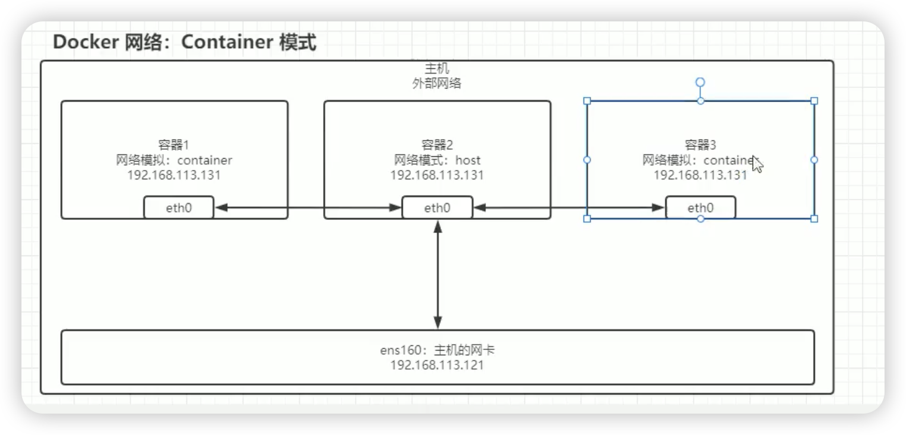

# 数据卷 Volume: 目录映射, 目录挂载
## 匿名绑定: 
匿名绑定的 volume 在容器删除的时候, 数据卷也会被删除, 匿名绑定是不能做到持久化的, 地址一般是 /var/lib/docker/volumes/xxxxx/_data
绑定卷时修改宿主机的目录或文件, 容器内的数据也会同步修改, 反之亦然
```bash
# 查看所有 volume
docker volume ls

# 用法: -v [容器内目录]      仅仅指定容器内的目录, 不指定宿主机的目录, 默认会自动创建一个匿名卷
docker run -d -p 80:80 --rm --name nginx_volume01 -v /usr/share/nginx/html nginx


# 查看卷详情
docker inspect nginx_volume01              # 里面 Mounts 的关键词就是 映射卷信息
docker volume ls
```

## 具名绑定: 
具名绑定与匿名绑定是类似的, 只是具名绑定会指定一个名字, 具名绑定卷在容器删除的时候, 数据卷不会删除, 具名绑定是可以做到持久化的, 路径一般是 /var/lib/docker/volumes/xxxxx/_data
```bash
# 用法: -v [卷别名]:[容器内目录]  指定卷名和容器内的目录, 创建后由docker统一管理
docker run -d -p 80:80 --rm --name nginx_volume02 -v nginx_test:/usr/share/nginx/html nginx

# 查看卷详情
docker inspect nginx_volume02
docker volume ls               # 会查到一个名字为 nginx_test 的卷


# 重新创建新的容器并使用持久化挂载卷
## 先进行删除
docker stop nginx_volume02
docker rm nginx_volume02

## 重新创建新的容器并使用持久化挂载卷
docker run -d -p 80:80 --rm --name nginx_volume -v nginx_test:/usr/share/nginx/html nginx

## 查看
docker inspect nginx_volume
docker volume ls
```

## Bing Mount: 
前面两种方式都是docker内部自动管理这些卷的, 但是bing mount是手动管理这些卷的, 也就是手动指定宿主机的目录和容器内的目录
```bash
# 用法: -v [宿主机的目录]:[容器内的目录]  指定宿主机的目录和容器内的目录
# 可以映射多个目录, 一个 -v 只能映射一个目录, 多个目录需要多个 -v
docker run -d -p 80:80 --rm --name nginx_volume03 -v /root/projects/www/nginx_test:/usr/share/nginx/html nginx

# 查看卷详情
docker inspect nginx_volume03
docker volume ls
```

## volume 的常用命令
```bash
# 查看帮助
docker volume --help

# 列出所有 volume
docker volume ls

# 查看卷详情
docker volume inspect [卷名]

# 删除一个 volume
docker volume rm [卷名]

# 清理无用的 volume
docker volume prune
```


# 网络配置 Network
- 提供了多种模型, 可以定制化为每个容器制定不同的网络
- 自定义网络模式, 划分不同的子网以及网关, dns等配置
- 网络互通
    - 实现不同子网之间的网络互通
    - 基于容器名(主机名)的方式在网络内访问

## 网络模式

### bridge 模式 (桥接模式), 默认使用
在主机中创建一个 docker0 的虚拟网桥(虚拟交换机), 在 docker0 创建一对虚拟网卡, 有一半在宿主机上 vethxxxx, 还是一半在容器内 eth0


#### bridge 模式 容器互联通信
```bash
# 启动两个容器, 用于测试两个容器之前的通信
docker run -d -P --rm --name centos_network1 centos tail -f /dev/null
## tail -f /dev/null  是让容器启动时运行的命令, 为了让容器一直运行, 不退出

# 使用 --link 参数, 让两个容器之间建立连接
docker run -d -P --rm --name centos_network2 --link centos_network1 centos tail -f /dev/null

# 测试两个容器是否可以通信
docker exec -it centos_network2 ping centos_network1     # 由于 centos_network2     link     centos_network1, 所以可以通信
docker exec -it centos_network1 ping centos_network2     # 但是 centos_network1 不能 ping centos_network2, 因为 --link 参数是单向的

# 参看容器的详细信息
docker inspect centos_network1
docker inspect centos_network2
```


### host 模式 (主机模式)
容器将不会获得一个独立的网络命名空间, 而是和宿主机共享网络命名空间, 容器将不会虚拟出自己的网卡以及配置自己的 IP 等, 那么基于该模式启动的容器对应的ip实际就是与宿主机同一个子网, 同一个网段
192.168.113.1    -->    192.168.113.x


### none 模式
docker 会拥有自己的网络空间, 不与宿主机共享, 在这个网络模式下的容器, 不会被分配网卡 ip 路由等相关信息
特点: 完全隔离, 与外部任何机器都无网络访问, 只有自己的本地网络lo网卡, 即127.0.0.1


### container 模式
新建的容器和已经存在的一个容器共享一个网络命名空间, 新的容器不会创建自己的网卡以及配置自己的 IP, 而是和指定的容器共享 IP, 端口范围等. 同样, 新的容器也不能访问已经存在的容器, 两者除了网络方面, 其他方面都是独立的



### 自定义网络模式(推荐)
不使用docker自带的网络模式, 而是自己去定制化自己特有的网络模式, 比如划分不同的子网, 网关, dns等配置
- 自定义网络模式, 划分不同的子网以及网关, dns等配置
- 网络互通
    - 实现不同子网之间的网络互通
    - 基于容器名(主机名)的方式在网络内访问

#### 自定义网络创建
- 查看主机的网络
```bash
# 查看网络的命令
ifconfig
# 或
ip addr

docker network [Command]
# 如:
docker network --help
docker network ls
```

- 创建自定义网络
```bash
# 创建自定义网络
docker network create --help

## 创建一个名为 wolfcode的网络, 子网为 192.168.30.0/24, 网关为 192.168.30.1
docker network create --driver bridge --subnet 192.168.30.0/24 --gateway 192.168.30.1 wolfcode
# --driver bridge 指定网络模式为 bridge 模式, docker默认就是 bridge 模式, 可以不写
# --subnet 192.168.30.0/24 指定子网, 桥接模式可以自定义, 但注意子网尽量不要和宿主机的子网冲突(可以使用 ifconfig/ip addr 查看宿主机的子网)
# --gateway 192.168.30.1 指定网关, 网关的ip地址需要和子网在同一个网段
# wolfcode 自定义网络名称
 

# 查看网络是否在里面
docker network ls

# ifconfig 或 ip addr 也可以查看网络
ifconfig
# 或
ip addr
```

- 自定义网络启动容器
```bash
# 启动一个 nginx 容器, 指定网络为 wolfcode
docker run -d -p 3001:80 --rm --name nginx_network1 --net wolfcode nginx
## --net wolfcode 指定网络模式为使用自定义的 wolfcode 网络
## 启动容器时指定网络 --net


# 查看容器网络详情
docker inspect nginx_network1

# 进入容器内部看网络相关的信息
docker exec -it nginx_network1 /bin/bash
ip addr 
## 有些容器没有 ip addr 命令, 可以使用参看 hosts 文件的方式查看容器内部的主机名对应的ip地址是否与自定义网络配置一致
cat /etc/hosts
```


#### 容器互联通信
```bash
# 启动两个 centos 容器, 指定网络为 wolfcode, 测试容器之间是否可以相互通信
docker run -d -P --rm --name centos_network1 --net wolfcode centos tail -f /dev/null
docker run -d -P --rm --name centos_network2 --net wolfcode centos tail -f /dev/null
## -P 随机端口映射
## --net wolfcode 指定网络模式为使用自定义的 wolfcode 网络
## centos 是镜像名称
## tail -f /dev/null 是为了让容器一直运行, 否则容器会自动停止


# 查看容器的网络详情
docker inspect centos_network1
docker inspect centos_network2

# 进入容器内部看网络相关的信息
docker exec -it centos_network1 /bin/bash
cat /etc/hosts
## 192.168.30.2	centos_network1

# 也可以使用 ifconfig 或 ip addr 查看网络信息
ifconfig
# 或
ip addr

# 在 centos_network1 容器内部 ping centos_network2, 测试容器之间是否可以基于主机名相互通信
ping centos_network2


# 也可以直接使用docker exec -it 使用容器执行ping命令
docker exec -it centos_network1 ping centos_network2
## ping centos_network2  是ping centos_network2 的主机名, 而不是ip地址, 测试容器之间是否可以基于主机名进行通信
```


## 不同网络下容器互相通信

测试: 默认的bridge网络容器和自定义的wolfcode网络容器通信问题
```bash
# 使用不同的两个网络模式启动两个容器, 测试容器之间是否可以相互通信
# 启动一个 centos 容器, 默认网络为 bridge
docker run -d -P --rm --name centos_network1 centos tail -f /dev/null

# 启动一个 centos 容器, 自定义网络为 wolfcode
docker run -d -P --rm --name centos_network2 --net wolfcode centos tail -f /dev/null

# 查看容器的网络详情
docker inspect centos_network1
docker inspect centos_network2

# 尝试 centos_network2 去 ping centos_network1, 测试容器之间是否可以相互通信
docker exec -it centos_network1 ping centos_network2
## 或
docker exec -it centos_network1 ping 192.168.30.2
## 结果: 两种方式都无法ping通, 因为两个容器不在同一个网络下, 无法相互通信
```


解决方案: docker network connect
```bash
# 将 centos_network1 容器连接到 wolfcode 网络下
docker network connect wolfcode centos_network1

# 查看容器的网络详情
docker inspect centos_network1
docker inspect centos_network2

# 尝试 centos_network2 去 ping centos_network1, 测试容器之间是否可以相互通信
docker exec -it centos_network1 ping centos_network2
## 或
docker exec -it centos_network1 ping 192.168.30.2
## 结果: 可以ping通, 因为两个容器在同一个网络下, 可以相互通信
```


# Dockerfile
## Dockerfile 常见的命令

[dockerfile 官方文档](https://docs.docker.com/reference/dockerfile/#copy---from)

### **FROM: 指定基础镜像**

在 Dockerfile 中，`FROM` 是指定基础镜像的指令，也是所有 Dockerfile 的开头命令。该命令用于设置构建镜像所依赖的**基础镜像**。

#### 细节和用法说明

1. **功能**：
   - 指定当前镜像所基于的基础镜像。
   - 基础镜像必需是 Docker Hub 上的公开镜像或自定义镜像仓库中的镜像。
   - Dockerfile 中每个阶段的多阶段构建可以有多个 `FROM`，但**每个阶段**只能有一个 `FROM`。

2. **语法**：
   - 基础语法：
     ```Dockerfile
     FROM <镜像名>[:<版本标识>] [AS <阶段名称>]
     ```

3. **示例**：
   - 指定 CentOS 7 为基础镜像：
     ```Dockerfile
     FROM centos:7
     ```

   - 指定 Ubuntu 最新版本为基础镜像（`latest` 是默认标签）：
     ```Dockerfile
     FROM ubuntu
     ```

   - 使用多阶段构建（命名阶段）：
     ```Dockerfile
     FROM node:16 AS builder
     RUN npm install
     ```

---

### **MAINTAINER: 指定镜像的作者**

`MAINTAINER` 是 Dockerfile 中的**旧指令**，用于声明镜像创建者的信息（比如姓名和邮箱）。不过这个指令已经被弃用，建议使用 `LABEL` 指令来代替。

#### 细节和用法说明
1. **功能**：
   - 指定镜像的维护者，方便镜像的使用者进行联系或了解镜像作者信息。
   - 建议使用 `LABEL maintainer="作者信息"` 来替代。

2. **语法**：
   ```Dockerfile
   MAINTAINER <作者信息>
   ```

3. **示例**：
   - 使用 `MAINTAINER` 指令指定作者名与邮箱：
     ```Dockerfile
     MAINTAINER wolfcode <wolfcode@wolfcode.cn>
     ```

   - 替代写法（推荐）：
     ```Dockerfile
     LABEL maintainer="wolfcode <wolfcode@wolfcode.cn>"
     ```

---

### **LABEL: 指定镜像的标签元数据**

`LABEL` 指令用于为镜像添加描述性**元数据**，如版本、作者、描述信息等。

#### 细节和用法说明
1. **功能**：
   - `LABEL` 为镜像添加键值对类型的元数据。
   - 可以为镜像添加多条 `LABEL` 信息，也可以在一条 `LABEL` 指令中定义多个键值对。

2. **语法**：
   - 单条 `LABEL` 语法：
     ```Dockerfile
     LABEL <key>=<value>
     ```

   - 多条 `LABEL`：
     ```Dockerfile
     LABEL <key1>=<value1> <key2>=<value2>
     ```

   - 推荐换行书写：
     ```Dockerfile
     LABEL key1=value1 \
           key2=value2 \
           key3=value3
     ```

3. **示例**：
   - 添加版本和描述信息：
     ```Dockerfile
     LABEL version="1.0"
     LABEL description="This is a test Dockerfile"
     ```

   - 使用换行格式：
     ```Dockerfile
     LABEL version="1.0" \
           description="This is a test" \
           maintainer="Name <name@example.com>"
     ```

---

### **ENV: 在容器中设置环境变量**

`ENV` 指令用于在容器构建过程中设置环境变量。设置的变量可以在运行时通过 `$NAME` 引用，也会影响到所有后续的指令。

#### 细节和用法说明

1. **功能**：
   - 在容器中设置环境变量，让变量可以在整个容器内被引用或用作配置参数。
   - 允许在执行指令时引用环境变量，例如设置 `PATH`。

2. **语法**：
   - 设置单个环境变量：
     ```Dockerfile
     ENV <key> <value>
     ```

   - 设置多个环境变量：
     ```Dockerfile
     ENV key1=value1 key2=value2 ...
     ```

3. **示例**：
   - 设置 `JAVA_HOME` 和更新 `PATH`：
     ```Dockerfile
     ENV JAVA_HOME /usr/local/java/jdk1.8.0_181
     ENV PATH $PATH:$JAVA_HOME/bin
     ```

   - 一次性设置多个变量：
     ```Dockerfile
     ENV JAVA_HOME=/usr/lib/java PATH=$PATH:$JAVA_HOME/bin
     ```

   - 在运行时可通过 `echo` 查看：
     ```bash
     docker run --rm my-image bash -c "echo $JAVA_HOME"
     ```

---

### **RUN: 容器中执行 Shell 命令**

`RUN` 指令用于在镜像构建过程中执行命令。每个 `RUN` 都会创建一个新的镜像层。

#### 细节和用法说明

1. **功能**：
   - 在镜像构建过程中执行命令，例如安装依赖、修改配置文件等。
   - 可以通过 shell 或 exec 形式运行指令。

2. **语法**：
   - Shell 形式（默认）：
     ```Dockerfile
     RUN <command>
     ```

   - Exec 形式（推荐，当需要精确控制参数时）：
     ```Dockerfile
     RUN ["<executable>", "<param1>", "<param2>", ...]
     ```

3. **示例**：
   - 使用 yum 安装 `vim`：
     ```Dockerfile
     RUN yum install -y vim
     ```

   - 执行多个命令：
     ```Dockerfile
     RUN mkdir -p /app && cd /app && touch test.txt
     ```

   - 使用 Exec 形式：
     ```Dockerfile
     RUN ["apt-get", "install", "-y", "curl"]
     ```

---

### **ADD: 复制并自动解压文件**

`ADD` 指令用于将宿主机的文件复制到容器中，同时支持自动解压（比如 `zip`）。`ADD` 可以从 URL 下载资源。

#### 细节和用法说明

1. **功能**：
   - 将本地或远程文件添加到镜像中。
   - 如果源为压缩文件（如 `.tar.gz`），会自动解压到目标路径。

2. **语法**：
   ```Dockerfile
   ADD <src> <dest>
   ```

3. **示例**：
   - 单文件复制：
     ```Dockerfile
     ADD ./data.txt /app/
     ```
   - 自动解压 `zip` 文件：
     ```Dockerfile
     ADD ./data.zip /app/
     ```

---

### **COPY: 纯粹复制文件（不会解压）**

`COPY` 是用于将主机上的文件和目录复制到镜像中，与 `ADD` 类似，但不支持 URL 或解压功能。

#### 细节和用法说明

1. **功能**：
   - 将本地文件复制到镜像中，简单且纯粹，不提供额外解压功能。

2. **语法**：
   ```Dockerfile
   COPY <src> <dest>
   ```

3. **示例**：
   ```Dockerfile
   COPY ./data.txt /app/
   ```

---

### **WORKDIR: 指定工作目录**

`WORKDIR` 用于设置容器中的工作目录。如果路径不存在，会自动创建。

#### 细节和用法说明

1. **功能**：
   - 指定接下来指令的工作目录（如 `COPY`、`RUN` 等）。

2. **语法**：
   ```Dockerfile
   WORKDIR /path/to/dir
   ```

3. **示例**：
   ```Dockerfile
   WORKDIR /app
   RUN touch file.txt
   ```

### **VOLUME:** 

在 Dockerfile 中，`VOLUME` 指令用于声明一个或多个可以挂载数据的挂载点（Mount Point），这些挂载点对应于容器中的目录。通过使用 `VOLUME`，你可以确保这些目录中的数据可以被独立保存，即使容器被移除，数据仍然可以持久化。

#### 细节和用法说明
1. **功能**：
   - 它在容器运行时定义了一个挂载点。注意，`VOLUME` 指令本身并不会把宿主机的路径挂载到容器中，而是告诉 Docker，这些指定的路径应该被挂载为匿名卷。
   - `VOLUME` 声明的目录默认会生成一个 Docker 卷，并将其挂载到容器中指定的路径。
   - 后续在 `docker run` 阶段，你可以通过 `-v` 或 `--mount` 参数，将自定义的宿主机目录挂载到这些挂载点来覆盖 Docker 默认生成的卷。

2. **语法**：
   - 单路径声明：`VOLUME <路径>`
   - 多路径声明（以空格分隔）：`VOLUME <路径1> <路径2> ...`
   - JSON 数组形式声明：`VOLUME ["<路径1>", "<路径2>", ...]`
   ```Dockerfile
   # 单路径声明
   VOLUME /data

   # 多路径声明
   VOLUME /data1 /data2

   # 使用 JSON 数组形式
   VOLUME ["/data", "/data2"]
   ```

3. **运行时挂载**：
   - 当你在 Dockerfile 中使用 `VOLUME` 后，如果运行容器时没有特别指定挂载点（未使用 `-v` 或 `--mount` 参数），Docker 会自动为这些路径创建匿名卷（Anonymous Volumes）。这些卷存储的数据会被独立保存，并不依赖容器的生命周期。
   - 如果运行容器时使用 `-v <主机目录>:<容器目录>` 或 `--mount`，你可以将宿主机目录挂载到 `VOLUME` 声明的路径中。

4. **注意事项**
   - **镜像构建阶段不能往 VOLUME 声明的路径写入文件**：
        - 在 Dockerfile 中，一旦路径被 `VOLUME` 声明后，在后续的构建中，无法再对这些路径写入文件，因为这些路径的数据源已经被抽象为外部卷。

   - **使用默认匿名卷可能会增加清理复杂性**：
        - 如果你不明确指定挂载路径，Docker 会创建匿名卷，并可能随着容器增多而占用存储空间。因此，推荐在 `docker run` 阶段明确指定宿主机路径或命名卷，避免创建难以管理的匿名卷。

5. **简单示例分析**

Dockerfile
```Dockerfile
FROM ubuntu:latest
VOLUME /data
CMD ["echo", "Data Volume Example!"]
```

构建镜像

```bash
docker build -t volume-example .
```

默认情况下运行容器
```bash
docker run --name my-container volume-example
```
- 此时 Docker 会为 `/data` 路径自动创建匿名卷进行挂载。
- 可以通过以下命令查看卷：
  ```bash
  docker inspect my-container
  ```

自定义挂载：
```bash
docker run --name custom-container -v /my/local/path:/data volume-example
```
- 此时 `/my/local/path`（宿主机目录）会挂载到容器中的 `/data` 路径。


### **EXPOSE: 指定容器暴露的端口**

在 Dockerfile 中，`EXPOSE` 指令用于声明容器对外暴露的端口，以便外部与容器进行网络通信。`EXPOSE` 声明的端口并不会自动映射到宿主机，需要运行时通过 `-p` 标志手动指定映射规则。

#### 细节和用法说明

1. **功能**：
   - 定义运行容器时的监听端口（仅声明作用，未做实际端口映射）。
   - 容器启动后，通过运行参数与宿主机的端口进行映射。

2. **语法**：
   ```Dockerfile
   EXPOSE <端口号>
   EXPOSE <端口号>/<协议>  # 可选协议为 TCP 或 UDP，默认为 TCP
   ```

3. **示例**：
   - 声明容器监听的 8080 端口（TCP 协议）：
     ```Dockerfile
     EXPOSE 8080
     ```

   - 声明容器同时监听 TCP 和 UDP 协议的 8080 端口：
     ```Dockerfile
     EXPOSE 8080/tcp
     EXPOSE 8080/udp
     ```

4. **运行时端口映射**：
   - 手动将容器暴露的端口与宿主机端口绑定：
     ```bash
     docker run -p 8080:8080 my-image
     ```
     上述命令会将宿主机的 8080 端口映射到容器监听的 8080 端口。

---

### **CMD: 指定容器启动时执行的默认命令**

`CMD` 指令用于在容器启动时指定默认执行的命令。如果使用 `docker run` 时传入其他命令，`CMD` 指定的命令将被覆盖。

#### 细节和用法说明

1. **功能**：
   - 为容器启动执行一个默认的命令和参数。
   - 如果 Dockerfile 中有多个 `CMD` 指令，**只有最后一个生效**。
   - `CMD` 是运行时命令，而非构建镜像时的命令。

2. **语法**：
   - Shell 形式：
     ```Dockerfile
     CMD <command>
     ```

   - Exec（数组）形式（推荐）：
     ```Dockerfile
     CMD ["executable", "参数1", "参数2", ...]
     ```

   - 与 `ENTRYPOINT` 联合使用：
     ```Dockerfile
     CMD ["参数1", "参数2", ...]
     ```

3. **示例**：
   - 使用 Shell 形式：
     ```Dockerfile
     CMD ls -al
     ```

   - 使用 Exec（数组）形式：
     ```Dockerfile
     CMD ["ls", "-al"]
     # 或者
     CMD ["sh", "-c", "ls -al"]
     ```

   - 输出信息：
     ```Dockerfile
     CMD echo "hello, docker"
     ```

---

### **ENTRYPOINT: 执行容器的入口点命令**

`ENTRYPOINT` 指令用于定义容器启动时的**主程序**（不可覆盖）。如果运行时希望加入额外参数，可以与 `CMD` 配合使用。

#### 细节和用法说明

1. **功能**：
   - 用于定义容器启动时的固定命令，并以其作为入口点。
   - 可以和 `CMD` 联合使用，固定的部分由 `ENTRYPOINT` 定义，动态参数由 `CMD` 定义。

2. **语法**：
   - Exec（数组）形式（推荐）：
     ```Dockerfile
     ENTRYPOINT ["executable", "参数1", "参数2", ...]
     ```

   - Shell 形式：
     ```Dockerfile
     ENTRYPOINT <command>
     ```

3. **示例**：
   - 固定使用 `echo` 执行输出命令：
     ```Dockerfile
     ENTRYPOINT ["echo", "Hello"]
     # 或者
     ENTRYPOINT ["sh", "-c", "echo Hello"]
     ```

   - 配合 `CMD` 使用：
     ```Dockerfile
     ENTRYPOINT ["python3"]
     CMD ["app.py"]
     ```
     - 启动容器时将最终运行：`python3 app.py`

---

### **USER: 指定容器内的用户**

`USER` 指令用于指定容器内后续指令的执行用户，默认用户为 `root`。 

#### 细节和用法说明

1. **功能**：
   - 更改构建和运行容器时的用户和用户组。
   - 以非 `root` 用户运行容器可以提升安全性。

2. **语法**：
   ```Dockerfile
   USER <用户名>[:<用户组>]
   ```

3. **示例**：
   - 切换为 `nobody` 用户：
     ```Dockerfile
     USER nobody
     ```

   - 设置用户和用户组：
     ```Dockerfile
     USER stu:group1
     ```

---

### **ARG: 构建参数**

`ARG` 指令用于声明镜像构建时可用的变量，这些变量仅在构建过程中有效，不会包含在最终镜像中。

#### 细节和用法说明

1. **功能**：
   - 定义 Dockerfile 构建过程中的参数，可用于动态化构建。

2. **语法**：
   ```Dockerfile
   ARG <参数名>[=<默认值>]
   ```

3. **示例**：
   - 定义默认值：
     ```Dockerfile
     ARG VERSION=1.0
     RUN echo $VERSION
     ```
   - 构建镜像时通过 `--build-arg` 修改值：
     ```bash
     docker build -t --build-arg VERSION=2.0 my_images:1.0 .
     ```

---

### **SHELL: 自定义容器中的 shell**

`SHELL` 用于指定构建过程中运行指令的 shell，默认情况下使用 `/bin/sh -c`。

#### 细节和用法说明

1. **功能**：
   - 更改默认的 shell。例如，使用 PowerShell 而非 `/bin/sh`。

2. **语法**：
   ```Dockerfile
   SHELL ["executable", "参数1", "参数2", ...]
   ```

3. **示例**：
   - 更改为 Bash：
     ```Dockerfile
     SHELL ["/bin/bash", "-c"]
     ```

   - 使用 Windows PowerShell：
     ```Dockerfile
     SHELL ["powershell", "-command"]
     ```

---

### **STOPSIGNAL: 自定义容器停止信号**

`STOPSIGNAL` 用于指定容器在停止时 Docker 向其发送的信号。

#### 细节和用法说明

1. **功能**：
   - 定义停止容器时应发送的信号（默认是 SIGTERM）。
   - 可用信号参考：[Linux Signals](https://man7.org/linux/man-pages/man7/signal.7.html)。

2. **语法**：
   ```Dockerfile
   STOPSIGNAL <信号值>
   ```

3. **示例**：
   - 设置为 SIGKILL：
     ```Dockerfile
     STOPSIGNAL SIGKILL
     ```

   - 设置为自定义信号：
     ```Dockerfile
     STOPSIGNAL 9
     ```

### **HEALTHCHECK: 容器健康检查**

`HEALTHCHECK` 指令用于定义容器内某个服务或应用的健康检查机制，确保容器的状态可以被 Docker 监控。当容器运行时，Docker 会根据 `HEALTHCHECK` 的结果判断容器的健康状态，并标记为 `healthy`（健康）、`unhealthy`（不健康）、或 `starting`（检查未完成）。

#### 细节和用法说明

1. **功能**：
   - 定义容器运行时的健康检查逻辑，例如通过 HTTP 请求或执行命令的结果判断服务状态。
   - 健康检查会影响容器的状态，当服务出现异常时，容器的状态会变为 `unhealthy`。

2. **语法**：
   ```Dockerfile
   # 配置健康检查
   HEALTHCHECK [选项] CMD <命令>
   # 禁用健康检查
   HEALTHCHECK NONE
   ```
   - **选项**：
     - `--interval=<时间>`：设置检查的时间间隔，默认为 `30s`。
     - `--timeout=<时间>`：设置检查命令的超时时间，默认为 `30s`。
     - `--start-period=<时间>`：设置健康检查开始前的宽限期，允许容器启动所需时间。
     - `--retries=<次数>`：设置健康检查重试次数，默认为 `3`。

3. **命令返回规则**：
   - 返回值为 `0`：健康（`healthy`）。
   - 返回值为非 `0`：不健康（`unhealthy`）。
   - 超时或未响应：不健康（`unhealthy`）。

4. **示例**：

   - 使用 `curl` 检查 HTTP 服务是否正常：
     ```Dockerfile
     HEALTHCHECK --interval=5m --timeout=3s --start-period=30s --retries=3 \
       CMD curl -f http://localhost:8080/ || exit 1
     ```
     - 每隔 5 分钟检查一次容器内的 HTTP 服务（超时为 3 秒，启动宽限期 30 秒，重试 3 次）。
     - 如果服务未响应或返回错误状态码（非 2xx），容器会被标记为 `unhealthy`。

   - 检查 MySQL 服务是否就绪：
     ```Dockerfile
     HEALTHCHECK CMD mysqladmin ping -h localhost || exit 1
     ```

   - 禁用健康检查：
     ```Dockerfile
     HEALTHCHECK NONE
     ```


## 构建镜像
- docker commit 方式
必须基于`现有的容器`进行修改, 然后提交为新的镜像

```bash
# 基础结构
docker commit [OPTIONS] CONTAINER [REPOSITORY[:TAG]]

# OPTIONS 说明
## -a : 在commit时的作者
## -c : 使用dockerfile指令创建镜像
## -m : 在commit时的说明文字
## -p : 在commit时暂停容器运行
# 如:
docker commit -m "提交的描述信息" -a "作者" 容器id/容器名 镜像名:标签


# 首先, 启动一个容器
docker run --rm -d -p 3001:80 --name nginx_commit nginx

# 进入容器内部, 修改容器内容
docker exec -it nginx_commit /bin/bash
## 修改nginx的默认首页内容
echo "hello, nginx commit" > /usr/share/nginx/html/index.html

# 提交修改后的容器为新的镜像
docker commit -m "simple test docker commit" -a "wolfcode" nginx_commit mynginx_commit:1.0

# 查看镜像
docker images

# 启动新的镜像
docker run --rm -d -p 3002:80 mynginx_commit:1.0
## 访问 http://localhost:3002/ 可以看到修改后的内容
```


- docker build 方式

```bash
# 基础结构
docker build -t [OPTIONS] 镜像名:标签 Dockerfile路径/.
# 常用的 OPTIONS 说明
## --build-arg=[] : 设置镜像创建时的变量

# 如:
docker build -t mynginx:1.0 .

# 查看镜像
docker images
```

示例1:
```dockerfile
# 首先加入当前镜像的基础镜像
FROM python:3.10

WORKDIR /app

COPY ./requirements.txt .
COPY ./simple_fastapi.py .

RUN pip3 install -r requirements.txt

EXPOSE 8040

CMD ["python","simple_fastapi.py"]
```

构建镜像:
```bash
docker build -t myfastapi:1.0 .
```


# 构建自己的docker仓库Registry
## 阿里云容器镜像服务个人仓库
- [阿里云容器镜像服务](https://cr.console.aliyun.com/cn-hangzhou/instances/repositories)
- [阿里云容器镜像服务帮助文档](https://help.aliyun.com/document_detail/60743.html)
可以自己先创建一个`命名空间`与`镜像仓库`, 阿里云会自动给出 login pull push 的方法


## 使用 Nexus 镜像仓库

```bash
# 创建一个 nexus 持久化目录
mkdir -p ~/docker_test/nexus
# 开放权限, 防止docker内的用户没有操作权限
chmod 777 ~/docker_test/nexus

# 启动 nexus 的容器
docker run -d --restart=always -p 3005:8081 \
 -p 3006:5000 \
 -p 3007:5001 --name nexus -v ~/docker_test/nexus:/nexus-data \
 -e http_proxy=http://10.0.xx.xx:7892 \
 -e https_proxy=http://10.0.xx.xx:7892 \
  sonatype/nexus3

# 访问 http://localhost:3005/ 可以看到 nexus 的界面
# pull/push 
# 待更...
```


## 使用 Harbor 镜像仓库
使用harbor必须要先安装 docker 与 docker-compose

待更...


# Docker Compose
容器编排: 管理多个容器的生命周期, 并保证它们之间的依赖关系
副本数控制: 容器有时候需要启动多个副本集群, 保证高可用, 快速对容器集群进行弹性伸缩
配置共享: 容器集群中, 需要共享一些配置文件, 如数据库配置, redis配置等


官方文档: [docker-compose 官方文档](https://docs.docker.com/reference/compose-file/build/)

## Services 相关

见官方文档

## Networks 相关

见官方文档

## Volumes 相关

见官方文档

## Build 相关

**docker-compose 可以利用 docker-compose.yml 文件中的 build 字段来构建镜像(代替 docker build -t 命令), 构建镜像的上下文默认为 docker-compose.yml 文件所在的目录**

详情见上文compose官方文档


```docker-compose.yml
services:
   service_1:
      image: example/webapp
      build: ./webapp

   # 常用的方式
   # build上下文为当前目录下的backend目录, Dockerfile为backend目录下的Dockerfile
   service_2:
      image: example/database
      build:
         context: ./backend

   service_3:
      image: example/database
      build:
         context: ./backend
         dockerfile: ../backend.Dockerfile

   service_4:
      build: ~/custom
```


## 使用 docker-compose 的示例

### 首先写一个 docker-compose.yml 文件
```yml
services:
   # 定义一个服务
   service_1:
      # 定义镜像名
      image: "nginx"
      # # 定义容器名
      # container_name: "nginx_compose"
      # 定义端口映射
      ports:
         - "3010-3020:80"
      # 定义网络
      networks:
         - wolfcode_net
      # 定义环境变量
      environment:
         - ENV_VAR_1=VALUE_1
         - ENV_VAR_2=VALUE_2

      # # 定义依赖
      # depends_on:
      #    - service_2

      # 定义重启策略
      restart: "always"
      # 定义挂载目录
      volumes:
         - type: volume
           source: nginx_compose_test
           target: /usr/share/nginx/html

networks:
   # 自动创建一个网络  wolfcode_net 
   wolfcode_net:
      name: wolfcode_net
      driver: bridge
      ipam:
         driver: default
         config:
            - subnet: 192.188.0.0/16
              gateway: 192.188.0.1


volumes:
   nginx_compose_test:
     name: nginx_compose_test
```

### 使用 docker-compose config 验证配置文件格式是否正确
**`docker-compose` 命令通常有一个前提, 就是执行命令时, 当前目录必须在 `docker-compose.yml` 文件的目录下**

```bash
docker-compose config
```

### 使用 docker-compose up 启动服务

**`docker-compose` 命令通常有一个前提, 就是执行命令时, 当前目录必须在 `docker-compose.yml` 文件的目录下**

更多命令见: [docker-compose 命令 CLI](https://docs.docker.com/reference/cli/docker/compose/down/)

```bash
# 启动与创建服务
# 当修改了docker-compose.yml的配置, docker-compose up -d 也可以用于更新服务
docker-compose up -d
## 仅仅创建服务, 不启动
docker-compose create  # 根据当前目录下的 docker-compose.yml 文件创建所有的服务, 但是不启动
### 注意: create 后跟的是服务名, 而不是容器名, 下面的命令同理
docker-compose create 服务名  # 根据当前目录下的 docker-compose.yml 文件创建指定的服务, 但是不启动

# 查看服务状态
docker-compose ps
docker-compose ps -a
docker-compose images
docker-compose ls

# 停止服务
docker-compose stop        # 停止服务, 但是不删除容器
docker-compose stop 服务名  # 停止指定的服务, 但是不删除容器

# 启动服务
docker-compose start        # 启动服务
docker-compose start 服务名  # 启动指定的服务

# 删除服务
docker-compose down --help
docker-compose down        # 删除所有服务 容器 网络, 但是不删除挂载的目录
docker-compose down -v     # 删除所有服务 容器 网络, 同时删除挂载的目录
docker-compose down 服务名  # 删除指定的服务, 但是不删除挂载的目录
```

### 使用docker-compose 完成弹性伸缩
```bash
# 注意: scale 后跟的是服务名, 而不是容器名
# 该命令会自动停止现有的服务, 并启动新的服务
docker-compose up -d --scale 服务名=副本数

docker-compose up -d --scale service_1=3
docker-compose up -d --scale service_1=2
docker-compose up -d --scale service_1=5
```

### 使用 docker-compose logs 查看日志
```bash
# 查看服务日志
docker-compose logs
docker-compose logs -f
docker-compose logs -f 服务名
```


# Docker Swarm


在 Docker Swarm 集群中，不同节点需要通过内部的网络协议进行通信，以实现集群管理、服务分发以及任务调度等功能。为了确保通信正常，您需要开放一系列特定的端口。这些端口包括 Swarm 自身的管理、集群节点间的网络通信，以及应用服务所需要暴露的端口。

| **端口** | **原因/必要性**                                                                        |
|----------|----------------------------------------------------------------------------------------|
| 2377/TCP | 用于 Swarm 集群管理（加入或离开节点）。                                                |
| 7946/TCP | 用于 Manager 节点间的状态同步和心跳。                                                  |
| 7946/UDP | 用于服务调度的 Gossip Protocol（群组通信协议）。                                       |
| 4789/UDP | 支持 Overlay 网络，确保服务（例如容器之间）在不同节点上的网络通信。                    |
| 服务端口 | Manager 节点上运行的服务所需要暴露的端口（如 3000:80、80:80 等，由具体服务配置决定）。 |

**端口开启后, 需要重启 docker 服务才能生效: sudo systemctl restart docker**

## swarm 基本概念
首先，Docker Swarm 是什么？  
Docker Swarm 是一个用于管理和编排 Docker 容器的集群工具，它允许我们在多个主机上运行容器，就像运行在一台机器上的容器一样简单，并集成了基本的负载均衡功能。

- **swarm** : 集群的管理和编排
   docker swarm --help
- **node** : 集群中的docker 节点, 类似于 k8s 的 node 节点, 分为 manager 和 worker
- **service** : 服务(Services) 是指的是一组任务的集合, 服务定义了任务的属性. 服务有两种模式:
   - **replicated services** : 基于指定副本数量进行任务调度
   - **global services** : 每个节点都运行一个任务

   两种模式通过docker service create 的 --mode 参数指定
   

- **task** : Task 是 Swarm 中的最小的调度单位, 目前来说就是一个单一的容器, 类似于 k8s 的 pod 中的容器

## 集群搭建
准备3台云服务器用于测试, 一个manager, 两个worker node, 3台服务器都安装了 docker, 并开启了上文中的端口
1. 初始化集群
```bash
docker swarm --help

# 初始化集群, 并将当前节点设置为 manager 节点
docker swarm init --advertise-addr <MANAGER-IP>  # <MANAGER-IP> 是当前节点的 IP 地址
# 如:
docker swarm init --advertise-addr 119.3.xxx.xxx

# 运行完成后, 会返回一个 node token 命令, 用于 worker 节点加入集群
# 格式大概为:
# docker swarm join --token SWMTKN-1-5jz0q4z7jz0q4z7jz0q4z7jz0q4z7jz0q4z7jz0q4z7jz0q4z7jz0q4z7jz0q4z7j 119.3.xxx.xxx:2377

# 在另外两个 worker 节点上运行该命令即可加入集群
```

```bash
# 获得worker节点加入集群的token(管理节点运行命令)
docker swarm join-token worker
# 获得manager节点加入集群的token(管理节点运行命令)
docker swarm join-token manager
```

**`Warning: 不同的云服务器商私网ip(网卡eth0)之间是无法通信的, docker swarm 默认可能会把私网ip加入到 ingress网络中, 即使worker节点可以正常加入到swarm, 管理节点也可能无法发送信息到worker节点的私网ip, 造成ingress自动负载转发异常, 解决方式如下: `**

```bash
# docker swarm join  加入新参数 --advertise-addr 工作节点的公网ip  即可解决
docker swarm join --token xxxxxxxxxxxxxxxxxx --advertise-addr <WORKER-公网IP> <MANAGER-IP>:2377


# 查看是否成功
## 工作节点:
docker info
### 内部有swarm 的信息

## 查看 docker ingress 网络的配置(管理节点运行)
docker network inspect ingress
### 里面 的"Peers": 内部的信息是否正确

## 查看 docker ingress 网络的配置(工作节点运行)
docker network inspect ingress
### 里面 的"Peers": 内部的信息是否正确

```


2. 查看集群状态(管理节点运行)
```bash
docker node --help
docker node ls
docker node ps
docker node inspect <NODE-ID>  # <NODE-ID> 是节点的 ID
```


## 部署服务
1. 创建并启动服务
```bash
docker service --help
docker service create --help

# 创建并启动服务
# 默认启用 Ingress 网络, 显式告诉 Swarm 将单独的 3000 端口暴露给集群范围, 启用 Ingress 网络，实现请求的集群范围转发。
docker service create --replicas 2 --publish 3000:80 --name nginx_swarm nginx
docker service create --replicas 2 -p 3000:80 --name nginx_swarm nginx

docker service create --replicas 2 -p 3000-3005:80 --name nginx_swarm nginx
```

---

### **1. Docker Swarm 的 `--publish` 及负载均衡机制**

#### 1.1 `--publish` 如何实现负载均衡？
Docker Swarm 的 `--publish` 参数用于将服务的容器端口暴露给外界访问，并通过 Swarm 内部的负载均衡器实现流量的自动分发。

**步骤讲解：**

1. **创建服务并暴露端口：**
   - 我们通过 `docker service create` 创建一个服务，例如运行一个 `nginx` 服务并暴露端口：
     ```bash
     docker service create --name my_service --replicas 5 --publish 8080:80 nginx
     ```
     - `--name my_service` ：给服务命名。
     - `--replicas 5`：运行 5 个副本（即 5 个容器）。
     - `--publish 8080:80`：对外暴露端口 8080，将其映射到容器内的 80 端口（`nginx` 默认使用 80 端口）。

2. **服务的分布与负载：**
   - Swarm 会根据集群中的可用节点，把 5 个副本均匀分布到节点上（除非有节点资源不足等情况）。
   - 假设有 3 台节点，服务可能会分布如下：
     - `node-1`：运行 2 个副本。
     - `node-2`：运行 2 个副本。
     - `node-3`：运行 1 个副本。

3. **外部流量的进入：**
   - 外部用户通过访问集群中任意节点的 IP 和暴露的 8080 端口访问这个服务：
     ```bash
     http://<任意节点的IP>:8080
     ```
   - Docker Swarm 的负载均衡机制会将请求根据简单的轮询策略分发到服务的 5 个副本中。

4. **Ingress 网络：**
   - Swarm 使用一个特殊的分布式网络，叫做 **Ingress 网络**，来管理流量。
   - 即使请求进入了一个没有直接运行副本的节点，该节点也会通过 Ingress 网络将流量转发到运行任务副本的节点。例如：
     > 流量进入了 `node-2`，而副本在 `node-1` 上运行，`node-2` 会自动将流量转发到 `node-1`。
   
**特点：**

- **简单而透明：** Swarm 用户完全不需要关心副本的具体位置，也不需额外配置负载均衡器。
- **负载分配策略：** Swarm 默认采用简单的 **轮询（Round-Robin）** 策略，将流量依次分配到服务的多个副本。

---

#### 1.2 Swarm 的优缺点
- **优点：**
  - 极简风格：仅需 `--publish` 一行命令，即可实现负载均衡。
  - 易用性强，适合中小型应用场景。
  - 内部的集群式端口暴露（Ingress 网络）隐藏了复杂性。

- **缺点：**
  - Swarm 的负载均衡机制较为基础，只能基于简单的轮询分配流量。
  - 无法根据副本的资源消耗（如 CPU、内存）做智能调度，不适合复杂场景。

---

### **2. Kubernetes 的负载均衡机制**

Kubernetes（K8s）是 Docker Swarm 的强大竞争对手，它是现代化云原生架构中的核心工具。相比 Swarm，K8s 提供了更加**复杂、灵活的负载均衡机制**。

#### 2.1 Kubernetes 的负载均衡方法

在 K8s 中，负载均衡分为多个层次：

1. **内部流量负载均衡：**
   - K8s 提供了一种叫做 `ClusterIP` 的 "虚拟 IP" 机制，用来在服务（Service）和 Pod（容器）之间实现流量的分发。
   - Service 会根据 Pod 的实际状态（健康检查的结果）动态分发流量到健康 Pod。

2. **外部流量负载均衡：**
   - 在 Kubernetes 中，外部流量通常通过 `NodePort` 或 `LoadBalancer` 类型的服务进入集群。
     - **NodePort:** 将一个节点的某个端口暴露给外界，用于接收流量。
     - **LoadBalancer:** 使用云供应商的负载均衡器（如 AWS、GCP 的 Load Balancer）分发流量到集群节点。

3. **高级应用：Ingress Controller**
   - K8s 支持使用 Ingress（基于 L7 网络协议的负载均衡）管理 HTTP 请求，通过域名、URL 路径等规则分发流量到不同服务。

---

#### 2.2 Kubernetes 的优点
- 支持多层次负载均衡，从内部 IP 转发到外部代理（如 Nginx Ingress）。
- 可以扩展自定义流量转发规则，例如基于 HTTP Header 的分发。
- 能力远超 Swarm，但复杂度也更高。


2. 查看集群服务状态(管理节点运行)
```bash
docker service --help
docker service ls

docker service inspect <SERVICE-ID>  # <SERVICE-ID> 是服务的 ID
docker service inspect --pretty <SERVICE-ID>  # <SERVICE-ID> 是服务的 ID
# --pretty 参数可以简化展示服务信息

docker service logs -f <SERVICE-ID>  # <SERVICE-ID> 是服务的 ID

docker service ps <SERVICE-ID>  # <SERVICE-ID> 是服务的 ID

# 删除服务
docker service rm <SERVICE-ID>  # <SERVICE-ID> 是服务的 ID
## 验证 docker service ls


# 判断某一个节点是否在集群中
## 1. 管理节点运行
docker node ls
docker node inspect <NODE-ID>  # <NODE-ID> 是节点的 ID

## 2. 任何节点都可以通过以下命令查看
docker info   # 看看里面是否有swarm 相关的信息

```


## 弹性伸缩

### 1. 调整实例的个数
```bash
# 调整服务的副本数量
docker service update --replicas 5 <SERVICE-ID/NAME>  # <SERVICE-ID> 是服务的 ID
```


### 2. 调整集群的规模
```bash
# 离开swarm
## 各个节点运行
docker swarm leave --force


# 加入swarm
## 获得worker节点加入集群的token(管理节点运行命令)
### docker swarm join-token worker
## 获得manager节点加入集群的token(管理节点运行命令)
### docker swarm join-token manager

# 注意: --advertise-addr <WORKER-公网IP> 可以看情况加入, 原因正如上文所讲, 保证worker节点能够被manager节点找到
docker swarm join --token SWMTKN-1-4q1j0p9w6w3z9xv2v6z1q6w3z9xv2v6z1q6w3z-3j3z9xv2v6z1q6w3z9xv2v6z1q6w3z --advertise-addr <WORKER-公网IP> <MANAGER-IP>:<MANAGER-PORT>
```


## 服务更新

```


# Docker Machine